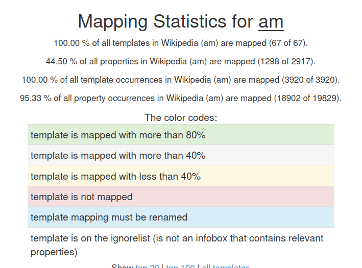
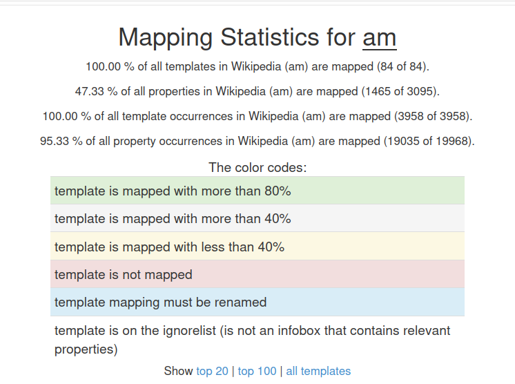

This post summarizes the progress made during the twelfth GSoC coding week (August 17 – August 23).  
The main focus was on **mapping unmapped templates and properties, fixing ignore-list issues, updating Wikipedia dump coverage, and experimenting with automation models**.

<!--more-->

## Tasks Completed

### 1. Ignore-List Debugging
- Found that the ignore-list feature failed due to **Unicode mismatches** between template and property names.  
- Fixed the implementation, which allowed the mapping statistics to correctly exclude non-relevant templates.  

---

### 2. Template and Property Mapping
- Identified unmapped templates and properties from the mapping statistics report.  
- Added new templates in **mapping.dbpedia.org** and updated missing properties.  
- Outcome: **100% of templates mapped** and **44.5% of properties covered** so far.  
- The major challenge was selecting the most appropriate property names from the DBpedia ontology, which is time-consuming and requires iterative refinement.  

---

### 3. Updating Wikipedia Dump with New Templates
- Added **19 Wikipedia pages** corresponding to newly created templates.  
- This ensures the templates are not ignored by default in the statistics pipeline.  
- Generated mapping statistics using the updated Wikipedia dump from **2025-08-20**.  

---

### 4. Automation Experiments
- Began experiments on automating template and mapping creation.  
- Tested **facebook/nllb-moe-54b** and **facebook/nllb-200-3.3B** models, based on mentor recommendations.  
- The workflow is still in progress and requires further experimentation.  

---

### 5. Blog Post Update
- Published the **Week 11 blog post** on the GitHub Pages project blog.  

---

## Next Steps
- Map missing properties and move closer to **100% coverage**.  
- Finalize the **automation workflow** for template and mapping creation.  

---

## Conclusion
This week marked strong progress toward improving mapping coverage and automation. With all templates now mapped and nearly half of properties aligned, the next focus will be expanding property coverage, refining the ignore-list handling, and building a reliable automated workflow.
