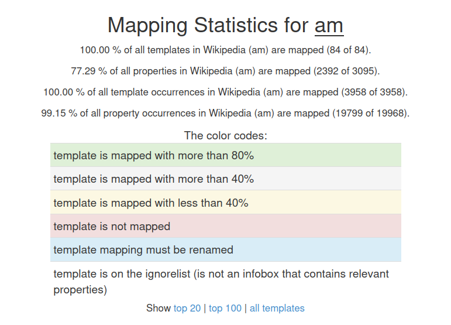
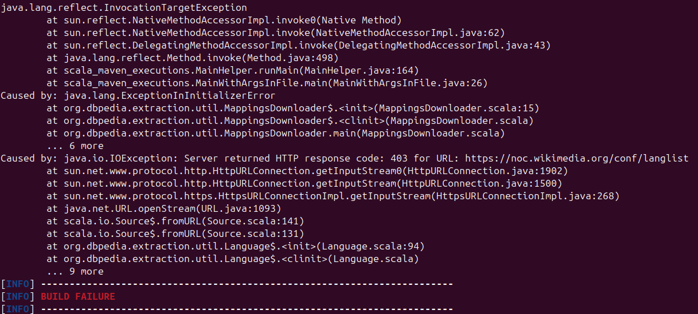

This post summarizes the progress made during the thirteenth GSoC coding week (August 24 – August 30).  
The main focus was on **finalizing the project report, improving property mappings, preparing documentation, and resolving extraction framework issues**.

<!--more-->

## Tasks Completed

### 1. Automation Update
- Continued work on automation, but based on mentor recommendations, the process was paused due to time constraints.  
- Agreed to resume automation development **after GSoC submission**.  
- Current status has been pushed to [this repository](https://github.com/contact-andy/Amharic_DBpedia_Template_Mapping_Automation).  

---

### 2. Project Report Preparation
- Created a **project report page** in GitHub:  
  [GSoC-25_DBpedia_Amharic_Chapter](https://github.com/contact-andy/GSoC-25_DBpedia_Amharic_Chapter).  
- The report includes:  
  - Project summary  
  - Key achievements  
  - Deliverables  

---

### 3. Extracted Data
- Pushed the extracted data to:  
  [AmharicDBpedia Dump](https://github.com/AmharicDBpedia/AmharicDBpedia/tree/GSOC2025/amDbpediaDump).  

---

### 4. Property Mapping Progress
- Continued mapping of previously unmapped properties.  
- Challenge: selecting the most appropriate property names from DBpedia ontology.  
- Outcome this week:  
  - **Templates mapped:** 100%  
  - **Properties mapped:** 77.29%  
  - **Template occurrence in Wikipedia mapped:** 100%  
  - **Property occurrence in Wikipedia mapped:** 99.15%  

---

### 5. Communication wtih DBpedia Team
- I communicated with the DBpedia team about the approach (Local Mapping Statistics in the Extraction Framework). They reviewed it and confirmed that the direction is fine, but they also highlighted the need for a unit test to ensure the reliability of the feature. I have started working on that unit test and plan to finalize it in the coming weeks.

---

### 6. Documentation 
- Produced the **project documentation** and sent it to mentors for review.  
- Documentation includes:  
  - Guide to configuring the DBpedia Extraction Framework.  
  - Steps for creating templates and mappings.  
  - Generating and interpreting statistics.  

---

### 7. Extraction Framework Debugging
- Faced an issue where the extraction framework stopped working due to a **connection error**.  
- After debugging, identified the problem in `Language.scala`.  
- Fixed by adding a **user-agent option** in the code.  
- Patch will be committed to GitHub.

---

### 8. Website Update
- Based on mentor recommendation, avoided creating a separate website.  
- Instead, updated the **existing website** with a simple JavaScript script to make future contributions easier.  
- Website will be pushed here:  
  [AmharicDBpedia Website](https://github.com/AmharicDBpedia/AmharicDBpedia/tree/GSOC2025).  

---

### 9. Mentor Meeting
- Attended **Week 13 mentor meeting** on **August 29, 2025**.  
- Shared the project status and received feedback.  
- Mentors requested a **2–3 page achievement summary document**.  

---

### 10. Blog Post Update
- Published the **Week 12 blog post** on the GitHub Pages project blog.  

---

## Next Steps
- Test and push the website updates.  
- Convert documentation into a GitHub wiki page.  
- Finalize unit tests and submit a PR to the main DBpedia repository.  
- Write a **2–3 page achievement summary** for mentors.  
- Finalize the **GSoC final submission**.  

---

## Conclusion
This week focused on preparing the final deliverables of the project. With property mappings reaching over **77%**, documentation drafted, and key framework issues resolved, the groundwork for final submission is nearly complete. The next step is polishing documentation, unit tests, and final reports to wrap up the GSoC journey successfully.  
